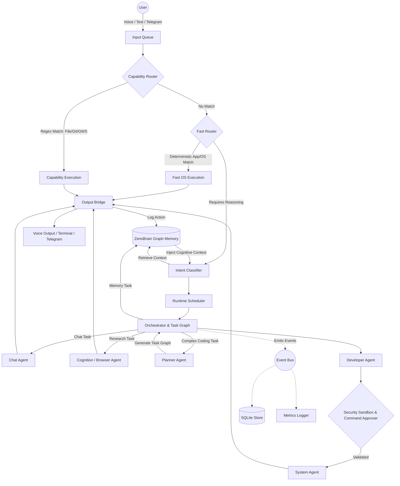
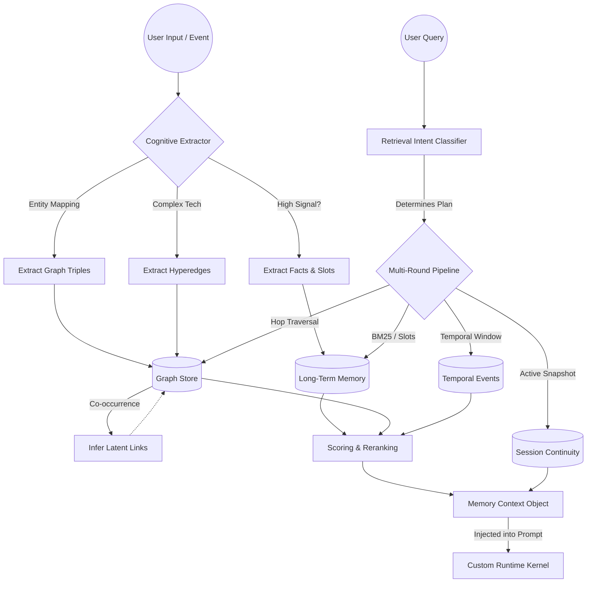

# ZENO v1: The Personal AI Operating System

Welcome to the future of personal computing. **ZENO v1 is not just a chatbot, a tool, or a script—it is a complete, autonomous Personal AI Operating System.** And incredibly, this is *only the first version*.

Built to replace fragmented workflows, ZENO v1 acts as the intelligent cognitive layer over your entire digital life. It bridges the gap between deterministic machine execution and profound artificial reasoning. By seamlessly integrating voice, text, memory, and sandboxed execution, ZENO manages your workspace, writes your code, automates your tedious tasks, and acts as a profound extension of your own mind.

Designed for uncompromising speed, privacy, and reliability, ZENO abandons bloated commercial frameworks in favor of a hyper-optimized, custom **Runtime Framework** powered by lightning-fast, privacy-first Small Language Models (SLMs).

---

## 🌌 The AI OS Experience: Key Features

### 🧠 Absolute Memory & Infinite Context Continuity
ZENO doesn't just respond; it *knows* you. It watches what you do, understands your projects, and remembers everything.
*   **Persistent Graph-Based ZenoBrain:** A sprawling, graph-based long-term memory engine. It permanently maps entities, relationships, temporal events, and latent links of your entire workflow.
*   **Start Exactly Where You Left Off:** Whether it's been an hour or a month, ZENO's **Session Continuity** instantly restores your working memory and project states. Drop a project today, and ZENO will seamlessly pick up the exact context tomorrow.
*   **Deep Cognitive Retrieval:** ZENO constantly analyzes your requests, pulling hyper-relevant sub-graphs from your history to inform its actions. It never loses track of the conversation.

### 🛡️ Ironclad Security & Sandboxed Execution
Power means nothing without safety. ZENO executes with military-grade precision and isolation.
*   **Sandboxed Command Execution:** Code generation, shell scripts, and system commands are evaluated and executed within an isolated sandbox, ensuring your host OS remains untainted and secure.
*   **Multi-Layered Security:** Built with stringent command approvers, deterministic safety checks, and strict boundary controls. You dictate what ZENO can touch.

### ⚡ Custom Runtime & Zero-Latency Fast Routing
We engineered out the wait. ZENO operates at the speed of thought.
*   **Capability Router & FastRouter:** Deterministic regex-based routing bypasses the AI completely. OS-level commands, Git operations, and direct file edits execute instantaneously.
*   **Bespoke RuntimeKernel:** We stripped away the bloat of standard AI frameworks. ZENO runs on a proprietary, lightweight `RuntimeKernel` utilizing an `Orchestrator`, `RuntimeScheduler`, and `EventBus` built for transparency, concurrent task graphs, and raw processing power.

### 🪶 Hyper-Optimized SLM Intelligence
ZENO gives you the power of massive AI clusters locally on your consumer hardware.
*   **Local, Low-RAM Dominance:** Deeply integrated with lightning-fast Small Language Models (SLMs) like **Qwen 2.5 3B Instruct**, **Llama 3.2 1B**, and **Granite 3 MoE 1B**. 
*   **Multi-Agent Swarm:** ZENO dynamically routes tasks to specialized agents registered in its kernel: a **Planner Agent** breaks down logic, a **Developer Agent** writes code, a **System Agent** handles shell ops, a **Browser/Cognition Agent** conducts web research, and a **Reminder Agent** handles schedules.

### 🎙️ Total Omni-Channel Control (Voice & Text)
Command your OS naturally.
*   **Push-to-Talk Command:** A global hotkey (`Ctrl+Space`) activates ZENO's local STT (Speech-to-Text). Speak naturally, and ZENO executes and responds via its natural TTS engine.
*   **Remote Telegram Bridge:** Away from your desk? Command your computer, check on running tasks, or continue coding sessions directly from your phone via ZENO's dedicated Telegram bot.

### 🌐 Google Workspace (GWS) Omniscience
ZENO integrates directly into the fabric of your professional life.
*   **Native GWS Integration:** Search your Google Drive, read and summarize unread Gmail, manage Calendar events, and automate Docs—all directly from the terminal or via voice, securely authenticated.

---

## 🏗️ Architecture Flowchart

How ZENO v1 processes your intent, retrieves cognitive memory, and executes safely using its custom `RuntimeKernel` and Event-Driven architecture.

---

## 🧠 Memory Subsystem: The ZenoBrain Architecture

At the heart of ZENO lies **ZenoBrain**, a remarkably complex and persistent memory subsystem built on SQLite. It does not just store text; it actively builds a temporal and relational Knowledge Graph of your life and workspace.

### Core Memory Modules
*   **Working Memory:** Short-term cache with a strict TTL. Holds active context, observations, and immediate session variables.
*   **Episodic Memory:** Automatically chunked interaction histories. Zeno summarizes your actions into episodic blocks and connects them hierarchically.
*   **Long-Term Semantic Graph:** The powerhouse. Text is ingested and broken down into:
    *   *Facts & Slots:* (e.g., `preferred_backend` = `Python`)
    *   *Graph Triples:* Directed edges connecting entities (`User` -> `knows` -> `React`).
    *   *Hyperedges:* Complex n-ary relationships linking multiple tech stacks or project concepts together.
*   **Session Continuity:** Actively takes snapshots of your workspace (`pending_todos`, `unresolved_problems`, `active_project`). Triggered by commands like *"continue where we left off"*, it perfectly reinstantiates your exact psychological and digital state.

### The Multi-Stage Retrieval Pipeline
When you ask ZENO a question, it doesn't just do a vector search. It executes a multi-round cognitive retrieval plan:
1.  **Intent Classification:** Determines if your query is about a *Person, Preference, Project, Device, or Temporal Event*.
2.  **Hybrid Fetching:** Pulls candidates via Full-Text Search (BM25), exact slot matching, graph traversal (multi-hop neighbors), and temporal windowing.
3.  **Reranking:** Candidates are ranked deterministically based on BM25 match, node importance (0.0 - 1.0), and semantic kind (`person` > `decision` > `fact`).

### Memory Flowchart

---

## 🚀 Experience The OS (v1)

*(Note: ZENO v1 is designed to run entirely locally with secure, privacy-first access to your filesystem and APIs.)*

### The "Start Where You Left Off" Magic
> **You:** "What were we working on last month before I went on vacation?"  
> **ZENO:** *(Queries ZenoBrain Graph)* "We were refactoring the multi-agent routing logic in `planner_agent.py` and tracking a bug in the Telegram Bridge. I have restored your workspace and loaded the context. Shall we fix the bridge bug?"

### Sandboxed OS Execution
> **You:** "Write a script to clean up all temporary files, but run it safely."  
> **ZENO:** *(Generates bash script, routes through Security Layer)* "I have written the cleanup script and executed it within the sandbox. The host OS remains secure. Here are the files that would be deleted..."

### Zero-Latency Voice Command
> **You:** *(Holding Ctrl+Space)* "Mute Spotify and summarize my latest unread emails."  
> **ZENO:** *(Instantly mutes volume via FastRouter, then queries GWS via SLM)* "System muted. You have 2 unread emails from your manager regarding the Q3 roadmap..."
