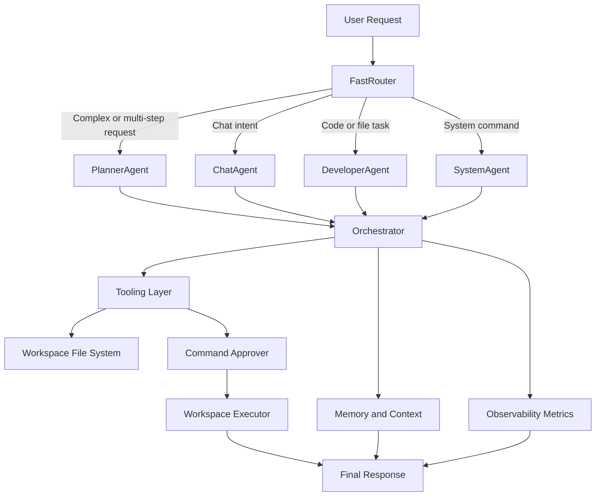

# ZENO

ZENO is a local AI assistant framework built as a systems-oriented Python project rather than a thin chatbot wrapper. It combines task routing, agent-based execution, sandboxed workspace operations, observability, and optional voice I/O into a single assistant runtime designed for real machine-side actions.

The project is focused on engineering concerns that matter in production software: clear separation of responsibilities, safety boundaries for command execution, fallback behavior across model providers, structured metrics, and test coverage for critical routing and reminder flows.

## What It Does

- Routes user requests through a fast-path classifier to avoid unnecessary LLM calls for obvious actions.
- Orchestrates multi-step work through typed tasks, dependency-aware execution, and agent-specific routing.
- Supports conversational assistance, planning, code generation, reminder management, and Windows system actions.
- Executes approved shell commands inside a constrained workspace sandbox.
- Provides optional voice input/output for a hands-free local assistant workflow.
- Logs structured metrics for routing, tool execution, planner validation, and LLM latency.

## Why This Project Is Interesting

ZENO is intentionally built to demonstrate backend and systems thinking:

- An execution kernel in [`zeno/core/orchestrator.py`](/C:/Users/KIIT0001/Desktop/ZENO/zeno/core/orchestrator.py) models work as typed tasks with dependency graphs, status transitions, and cooperative interruption.
- A lightweight classifier in [`zeno/core/fast_router.py`](/C:/Users/KIIT0001/Desktop/ZENO/zeno/core/fast_router.py) handles deterministic requests in milliseconds before escalating to planner or chat paths.
- Safety boundaries are explicit: [`zeno/core/command_approver.py`](/C:/Users/KIIT0001/Desktop/ZENO/zeno/core/command_approver.py) gates command execution, and [`zeno/core/workspace_executor.py`](/C:/Users/KIIT0001/Desktop/ZENO/zeno/core/workspace_executor.py) keeps shell actions inside a sandboxed workspace with timeouts and captured output.
- Reliability is treated as a first-class concern through model fallback logic in [`zeno/llm/hybrid_llm.py`](/C:/Users/KIIT0001/Desktop/ZENO/zeno/llm/hybrid_llm.py) and structured event logging in [`zeno/core/observability.py`](/C:/Users/KIIT0001/Desktop/ZENO/zeno/core/observability.py).

## Architecture

```text
User Input
  -> FastRouter
     -> ChatAgent
     -> PlannerAgent
     -> DeveloperAgent
     -> SystemAgent
  -> Orchestrator
     -> Task graph execution + dependency resolution
  -> Tooling Layer
     -> File system sandbox
     -> Workspace executor
     -> Windows app / volume / brightness controls
  -> Memory + Observability
     -> Reminders
     -> Context tracking
     -> JSONL metrics
```

## Execution Pipeline

```text
1. User submits a request
2. FastRouter checks for deterministic intents
3. Request is either:
   - handled directly by ChatAgent / DeveloperAgent / SystemAgent
   - escalated to PlannerAgent for multi-step decomposition
4. Orchestrator builds and executes the task graph
5. Approved tools run inside workspace and system safety boundaries
6. Results are logged through the observability layer
7. Final response is returned to the user, with reminders/context updated when needed
```

## Flow Chart



## Technical Stack

Core stack:

- Python
- Multi-agent runtime with typed task orchestration
- Local LLM integration through Ollama-style clients
- Hybrid model routing with remote fallback support
- JSONL-based observability and execution metrics

System and product capabilities:

- Rule-based intent routing for low-latency command handling
- Workspace-scoped file creation and shell execution
- Reminder storage and context management
- Voice input with `faster-whisper`
- Voice output with `pyttsx3`
- Windows system control via `pycaw`, `wmi`, and keyboard hooks

Engineering practices reflected in the codebase:

- Separation of concerns across `core`, `agents`, `llm`, `memory`, `tools`, and `voice`
- Safety-first execution boundaries
- Fallback-oriented design
- Test coverage for routing, reminders, and phase-level workflows
a
## Repository Layout

```text
zeno/
  agents/      Agent implementations for chat, planning, development, system control, reminders
  core/        Orchestration, routing, approvals, execution sandbox, metrics, task schemas
  llm/         Local, Gemini, Claude, and hybrid model clients
  memory/      Reminder models and persistence
  tools/       File-system and Windows application control helpers
  voice/       Speech input and speech output
tests/         Routing, reminder, and integration-oriented tests
start.py       Main interactive entrypoint
workspace/     Sandboxed workspace for assistant-generated artifacts
```

## Testing

Representative tests live under [`tests/`](/C:/Users/KIIT0001/Desktop/ZENO/tests) and cover routing logic, reminders, and phase workflows.

```bash
python -m pytest tests
```

Some OS-control and voice tests are environment-dependent and are most reliable on a Windows machine with the required device support.

## Current Focus and Tradeoffs

ZENO is strong as a local assistant runtime and orchestration project. It emphasizes controllable execution, deterministic routing, and safe tool use over polished UI or cloud-scale deployment. Some integrations are optional, environment-specific, or credential-gated, but the core project structure already reflects the kind of ownership, debugging discipline, and system decomposition expected in serious software engineering work.I am still working on this project.


